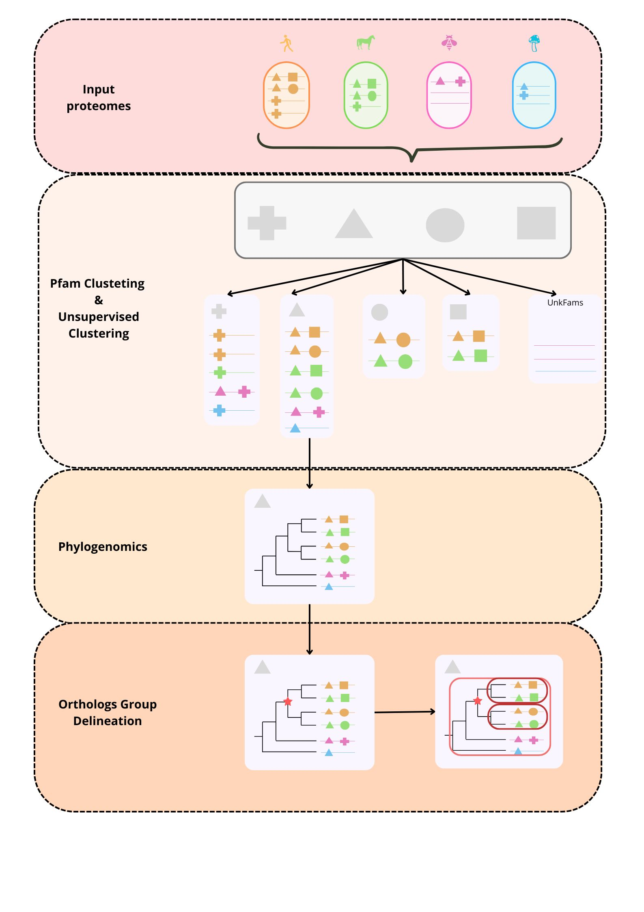

# 🧬 PBDOOD: Phylogeny-based Domain-oriented Orthology Delineation

**PBDOOD** is a bioinformatics pipeline designed to identify **Orthologous Groups (OGs)** across various proteomes. It leverages the **Nextflow** framework to automate a multi-step process, including initial protein clustering based on Pfam domains, phylogenetic tree building, and a final orthology analysis to define OGs.



---

## ✨ Key Features

* **Domain-Based Clustering (PfamFams):** Initial protein clustering groups sequences into Pfam families. Multi-domain sequences are assigned to all relevant Pfam families.
* **De Novo Clustering (UnkFams):** Sequences without identifiable Pfam domains are clustered separately using **MMseqs2**.
* **Automated Gene Tree Building:** For families with $\ge 3$ sequences, DOOD automatically generates multiple sequence alignments (MSAs), removes uninformative columns, and infers a gene tree.
* **Orthology Delineation (OGD):** The pipeline employs the OGD algorithm to analyze each gene tree, detect gene duplication events, and define OGs at various taxonomic levels, maintaining a hierarchical structure.

---

## ⚙️ Pipeline Steps

The fundamental process of PBDOOD is divided into three main steps:

### 1. Domain and *De Novo* Clustering
Preparation of the initial protein families (PfamFams and UnkFams).

### 2. Phylogenomics (MSA + Trimming + Tree Building)
Generation of high-quality alignments and inference of phylogenetic trees.

### 3. Orthology Delineation (OGD)
This robust algorithm analyzes the trees to detect duplications and define OGs. Key steps include:
* **Tree Setup:** Resolving polytomies, tree rooting, and adding taxonomic annotation from the NCBI taxonomy.
* **Taxonomic Misplacement Detection:** Identification of sequences likely misplaced within the tree.
* **Species Overlap Calculation:** For each internal node the algorithm calculates the species overlap, the proportion of shared species between two child nodes relative to the total number of species in the node .
* **Duplication Detection:** Identification of duplications that give rise to orthologous groups with a low rate of paralogs.

---

## 📋 Requirements and Dependencies

PBDOOD requires **Nextflow** as its workflow manager. To simplify execution, an **Apptainer** (Singularity) image is provided that includes all necessary dependencies.

### Dependencies Included in the Apptainer Image

| Category | Tools |
| :--- | :--- |
| **Clustering** | `eggnog-mapper`, `HMMER v3.1b2`, `MMseqs2`, `BioPython` |
| **Phylogenomics** | `Famsa`, `Mafft`, `FastTree` |
| **Orthology** | `ETE4`, `FastRoot` |

---

## 💻 Installation and Execution

### 1. With Apptainer (Recommended)

This method is the simplest, as it encapsulates all dependencies.

1.  **Install Nextflow:**
    ```bash
    curl -s [https://get.nextflow.io](https://get.nextflow.io) | bash
    chmod +x nextflow
    ```

2.  **Clone the DOOD repository:**
    ```bash
    git clone git@github.com:AnaHrnndz/cpo_nextflow.git
    cd cpo_nextflow
    ```

3.  **Download the Apptainer Image:**
    Download the image (`dood_img.sif`) from the link below and place it in a designated directory (e.g., `apptainer/`).
    `https://saco.csic.es/s/eQWa5qsGRW2EqxF`

4.  **Download and Set Up Data:**
    Download the necessary `data` folder from the link below. Place this `data` folder in the same directory as your main *script* `DOOD.nf`.
    `https://saco.csic.es/s/xjzGL86Cj2x2WJs`

    > **Project Structure:**
    > ```
    > cpo_nextflow/
    >     ├── DOOD.nf
    >     ├── bin/
    >     └── data/  # Downloaded data folder
    >         ├── pfam/
    >         ├── ete_taxonomy/
    >         └── proteomes.fasta
    > ```

5.  **Example Execution:**
    Run the complete pipeline using the Apptainer image:
    ```bash
    bash ./nextflow run DOOD.nf -with-apptainer apptainer/dood_img.sif -c local.config -with-trace -resume
    ```

---

### 2. Manual Installation

If you prefer to manage dependencies manually.

1.  **Create Conda Environment and Clone:**
    ```bash
    conda create -n dood_env python=3.10
    conda activate dood_env
    git clone git@github.com:AnaHrnndz/cpo_nextflow.git
    ```

2.  **Install Python Libraries:**
    ```bash
    pip install BioPython FastRoot eggnog-mapper
    # Forced ETE4 installation
    pip install --force-reinstall [https://github.com/etetoolkit/ete/archive/ete4.zip](https://github.com/etetoolkit/ete/archive/ete4.zip)
    ```

3.  **Install Additional Tools:**
    Manually download and set up **MMseqs2**, **FAMSA**, and **FastTree**. Consult their respective websites for installation instructions.

---

##  Input Files

DOOD requires a main FASTA file and optional reference files.

* **Proteome FASTA File (Required):**
    A single FASTA file containing all proteome sequences.
    * **Naming Convention:** Sequence headers must follow the format `ncbi_taxid.sequence_name` (Example: `9606.NP_000001.1`). The species delimiter (`.`) can be changed in the config file.

* **Optional Reference Files:**
    * **Pfam Database:** The pipeline is configured to use Pfam v35. You can replace the files in `data/pfam/` if you wish to use a different version.
    * **NCBI Taxonomy Database:** A specific version is provided in `data/ete_taxonomy/`. You can update it if needed.

---

##  Execution Parameters

Key parameters are managed via a configuration file (e.g., `local.config`). You can adjust these values to adapt the pipeline to your working environment.

| Parameter | Default Value (Example) | Description |
| :--- | :--- | :--- |
| **`input`** | `/data/proj/.../Dickeya.fa` | Full path to the input FASTA file. |
| **`general_output`** | `/data/proj/.../test_cpo_local` | Directory where all results will be saved. |
| **`pfam_db`** | `/data/proj/.../Pfam-A.hmm` | Path to the Pfam HMM database. |
| **`ogd_taxonomy_db`** | `/data/proj/.../e6.taxa.sqlite` | Path to the taxonomy database for OGD. |
| **`hmmer_cpu`** | `10` | Total CPUs for HMMER. |
| **`mmseqs_coverage`** | `0.3` | Minimum coverage for *de novo* clustering (MMseqs2). |
| **`mmseqs_min_seq_id`** | `0.3` | Minimum sequence identity for *de novo* clustering. |
| **`ogd_rooting`** | `"MinVar"` | Tree rooting algorithm (e.g., MinVar). |
| **`ogd_sp_delimitator`** | `.` | Delimiter used in the FASTA header to separate the taxid (e.g., `9606.NP_000001.1`). |
| **`ogd_sp_overlap`** | `0.1` | Species overlap threshold for duplication detection. |

---

##  How to Run DOOD

### Local Execution

* **Run the entire pipeline with Apptainer:**
    ```bash
    bash /path/to/nextflow run DOOD.nf -with-apptainer apptainer/dood_img.sif -c local.config -with-trace -resume
    ```
    *(Replace `/path/to/nextflow` with the actual path to your Nextflow executable.)*

* **Re-run up to a specific process (using `-until`):**
    Useful for resuming execution from a checkpoint, for example, restarting only Orthology Delineation (OGD):
    ```bash
    bash /path/to/nextflow run DOOD.nf -c new_local.config -with-trace -resume -until ogd_pfam,ogd_mmseqs
    ```

* **Run individual modules/sub-workflows (using `-entry`):**
    ```bash
    bash /path/to/nextflow run subworkflows/orthology.nf -c local.config -resume -entry MODULE_ORTHOLOGY
    ```

### HPC Execution

To submit DOOD to an HPC cluster (e.g., with Slurm), use a submission script and specify the Slurm configuration:

```bash
sbatch run_cpo_pipeline.sh cpo_nextflow/DOOD.nf slurm.config