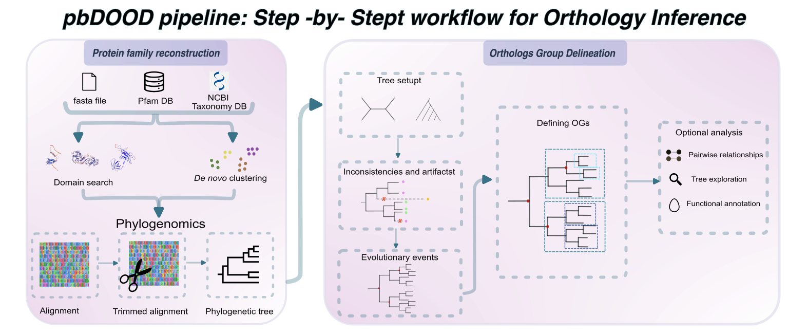
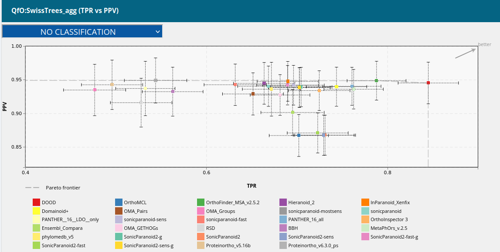
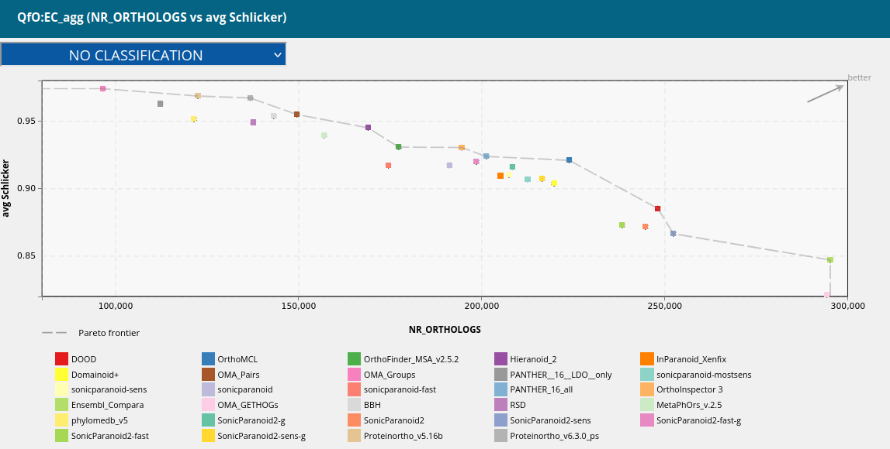
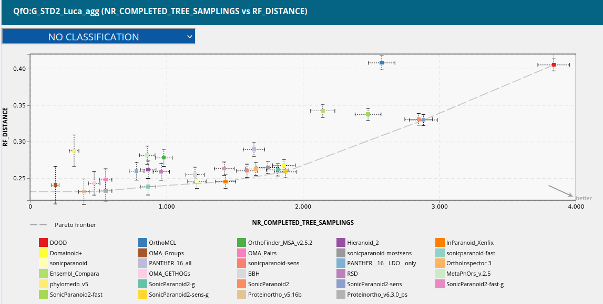

# 🧬 PBDOOD: Phylogeny-based Domain-oriented Orthology Delineation

**PBDOOD** is a bioinformatics pipeline designed to identify **Orthologous Groups (OGs)** across multiple proteomes. It uses the **Nextflow** framework to automate a multi-step process: initial protein clustering based on Pfam domains, phylogenetic tree building, and a final orthology analysis to define OGs.



---

## ✨ Key Features

* **Domain-based clustering (PfamFams):** Initial clustering groups sequences into Pfam families. Multi-domain sequences are assigned to all relevant Pfam families.
* **De novo clustering (UnkFams):** Sequences without identifiable Pfam domains are clustered separately using **MMseqs2**.
* **Automated gene-tree building:** For families with ≥ 3 sequences, PBDOOD generates multiple sequence alignments (MSAs), removes uninformative columns, and infers a gene tree.
* **Orthology delineation (OGD):** The OGD algorithm analyses each gene tree, detects gene-duplication events, and defines OGs at multiple taxonomic levels, keeping a hierarchical structure.

---

## ⚙️ Pipeline Steps

The pipeline is divided into three main steps:

### 1. Domain and *de novo* clustering
Preparation of the initial protein families (PfamFams and UnkFams).

### 2. Phylogenomics (MSA + trimming + tree building)
Generation of high-quality alignments and inference of gene trees.

### 3. Orthology delineation (OGD)
This algorithm analyses the trees to detect duplications and define OGs. Key steps include:
* **Tree setup:** resolving polytomies, tree rooting, and adding taxonomic annotation from the NCBI taxonomy.
* **Taxonomic misplacement detection:** identification of sequences likely misplaced within the tree.
* **Species-overlap calculation:** for each internal node, the proportion of species shared between the two child nodes relative to the total number of species in the node.
* **Duplication detection:** identification of duplications that give rise to orthologous groups with a low rate of paralogs.

---

## 📋 Requirements and Dependencies

PBDOOD requires:

* **Nextflow** (≥ 23.04) as the workflow manager.
* **conda** or **mamba** to install all the dependencies.

All bioinformatics tools are installed automatically through the provided `environment.yml`:

| Category | Tools |
| :--- | :--- |
| **Clustering** | `eggnog-mapper`, `HMMER`, `MMseqs2` |
| **Phylogenomics** | `FAMSA`, `MAFFT`, `FastTree` |
| **Orthology** | `ETE4`, `FastRoot` |

> The orthology step relies on **OG_Delineation** (pinned to release `v0.4.0`), which is installed via pip directly from the `environment.yml`, exposing the `og-delineation` command.

---

## 💻 Installation

1. **Install Nextflow** (requires Java 11+):
   ```bash
   curl -s https://get.nextflow.io | bash
   chmod +x nextflow
   # optionally move it somewhere on your PATH, e.g. ~/.local/bin
   ```
   Alternatively, Nextflow is also available via conda: `conda install -c bioconda nextflow`.

2. **Clone the repository:**
   ```bash
   git clone https://github.com/AnaHrnndz/pbdood.git
   cd pbdood
   ```

3. **Create the environment with all dependencies:**
   ```bash
   conda env create -f environment.yml   # or: mamba env create -f environment.yml
   conda activate pbdood
   ```
   This installs every tool, including OG_Delineation (`og-delineation`) via pip.

4. **Download the data bundle:**
   Download the `data` folder from the link below and place it in the repository root (next to `DOOD.nf`):
   `https://saco.csic.es/s/xjzGL86Cj2x2WJs`

   > **Expected project structure:**
   > ```
   > pbdood/
   >     ├── DOOD.nf
   >     ├── nextflow.config
   >     ├── bin/
   >     └── data/                # downloaded data bundle
   >         ├── pfam/
   >         ├── ete_taxonomy/
   >         └── Dickeya.fa
   > ```

---

## 📥 Input Files

* **Proteome FASTA file (required):** a single FASTA with all proteome sequences.
  * **Header convention:** `ncbi_taxid.sequence_name` (e.g. `9606.NP_000001.1`). The species delimiter (`.`) can be changed with `--ogd_sp_delimitator`.
* **Reference databases:**
  * **Pfam database** (`Pfam-A.hmm`, v35 by default) — read from `<pfam_datadir>/pfam/`, so you only pass `--pfam_datadir`.
  * **NCBI taxonomy database** (`e6.taxa.sqlite`) — under `data/ete_taxonomy/`, passed via `--ogd_taxonomy_db`.
  * **eggnog-mapper data dir** (optional) — only needed for functional annotation; pass via `--emapper_dir`. This database is large; if you don't provide it, the annotation step is simply skipped.

---

## 💡 Tips

### Database layout

Place the reference databases inside the `data/` folder so the default paths line up:

```
data/
├── pfam/
│   └── Pfam-A.hmm            # (+ hmmpress index files: .h3f .h3i .h3m .h3p)
├── eggnog.db                 # eggNOG-mapper annotation database
├── eggnog_proteins.dmnd      # eggNOG-mapper DIAMOND database
└── ete_taxonomy/
    └── e6.taxa.sqlite        # NCBI taxonomy for OGD
```

Then point each parameter at the right place:

* `--pfam_datadir /path/to/data` → the Pfam HMM is read from `<pfam_datadir>/pfam/Pfam-A.hmm`.
* `--emapper_dir /path/to/data` → the folder containing `eggnog.db` and `eggnog_proteins.dmnd` (needed only for functional annotation; omit to skip it).
* `--ogd_taxonomy_db /path/to/data/ete_taxonomy/e6.taxa.sqlite`.

### Preparing the databases

**Pfam.** Download the Pfam 35.0 files from the [Pfam FTP](https://ftp.ebi.ac.uk/pub/databases/Pfam/releases/Pfam35.0/) into `data/pfam/`:

* [`Pfam-A.clans.tsv.gz`](https://ftp.ebi.ac.uk/pub/databases/Pfam/releases/Pfam35.0/Pfam-A.clans.tsv.gz) — leave it as is (keep it gzipped).
* [`Pfam-A.hmm.gz`](https://ftp.ebi.ac.uk/pub/databases/Pfam/releases/Pfam35.0/Pfam-A.hmm.gz) — decompress it and run `hmmpress` to build the HMMER index files:
  ```bash
  gunzip Pfam-A.hmm.gz
  hmmpress Pfam-A.hmm
  ```
  `hmmpress` creates `Pfam-A.hmm.h3f`, `.h3i`, `.h3m` and `.h3p`. The `Pfam-A.hmm.idmap` is **not** produced by `hmmpress` — it is generated automatically by eggNOG-mapper's `hmm_server.py` the first time the database is loaded (on the first clustering run), so you don't need to create it manually.

After this (and a first run), `data/pfam/` will contain:
```
Pfam-A.clans.tsv.gz
Pfam-A.hmm
Pfam-A.hmm.h3f
Pfam-A.hmm.h3i
Pfam-A.hmm.h3m
Pfam-A.hmm.h3p
Pfam-A.hmm.idmap      # created by hmm_server.py on the first run
```

**eggNOG-mapper** *(optional — only for functional annotation).* Follow the official download instructions in the [eggNOG-mapper wiki](https://github.com/eggnogdb/eggnog-mapper/wiki/eggNOG-mapper-v2.1.5-to-v2.1.13#setup). PBDOOD only needs the **main annotation database** (`eggnog.db`) and the **DIAMOND database** (`eggnog_proteins.dmnd`); place both directly in `data/`.

**NCBI taxonomy (ete4).** OGD uses ete4's NCBI taxonomy database. ete4 downloads the NCBI taxonomy dump and builds the SQLite file automatically the first time you create an `NCBITaxa` object pointing at a given path. Build it once into `data/ete_taxonomy/`:

```bash
mkdir -p data/ete_taxonomy
python -c "from ete4 import NCBITaxa; NCBITaxa(dbfile='data/ete_taxonomy/e6.taxa.sqlite')"
```

This needs an internet connection and may take a few minutes. Then pass the resulting file with `--ogd_taxonomy_db data/ete_taxonomy/e6.taxa.sqlite`.

---

## ▶️ How to Run

Parameters can be set on the command line (`--param value`) or in the config files, with this **precedence (highest first)**: command line → the active profile's config (e.g. `conf/test.config`) → defaults in `nextflow.config`. So a value passed with `--param` on the command line always overrides whatever the config files set. `conf/local.config` and `conf/slurm.config` define the executor and resources.

### Configuration profiles

Profiles are switched on with `-profile` and combined with commas (no spaces):

* **Execution environment** (pick one): `local` (your own machine) or `slurm` (HPC cluster).
* **Optional**: `test`, to run the bundled example dataset with reduced resources.

For example: `-profile local` for a normal local run, `-profile slurm` on a cluster, or `-profile local,test` for a quick local smoke test. If two profiles set the same option, the one listed **last** wins.

### Local execution

* **Full pipeline:**
  ```bash
  nextflow run . -profile local \
      --input data/Dickeya.fa \
      --pfam_datadir data \
      --ogd_taxonomy_db data/ete_taxonomy/e6.taxa.sqlite \
      -with-trace -resume
  ```

* **Quick smoke test** (uses the bundled `data/Dickeya.fa`; fill in the DB paths in `conf/test.config` first):
  ```bash
  nextflow run . -profile local,test -resume
  ```

### Visualizing a tree

PBDOOD trees can be explored interactively with OG_Delineation's built-in viewer
(ete4 smartview). It runs as a standalone command — no need to go through Nextflow:

```bash
conda activate pbdood
og-delineation --tree path/to/your_tree_annot.nw --only_visualization
```

This launches an ete4 smartview server; open the address it prints in your browser. If you run it on a remote machine, forward the port first, e.g. `ssh -L <port>:localhost:<port> user@host` (use the port shown by the command).

### Cluster execution (SLURM)

Use the `slurm` profile (adjust queue names in `conf/slurm.config` to match your cluster):
```bash
nextflow run . -profile slurm \
    --input <fasta> --pfam_datadir <dir> --ogd_taxonomy_db <sqlite> \
    -with-trace -resume
```

---

## 🔧 Key Parameters

| Parameter | Default | Description |
| :--- | :--- | :--- |
| `--input` | *(required)* | Path to the input proteome FASTA. |
| `--pfam_datadir` | *(required)* | Path to the `data/` folder. The Pfam HMM database is read from `<pfam_datadir>/pfam/Pfam-A.hmm`. |
| `--ogd_taxonomy_db` | *(required)* | Path to the NCBI taxonomy database (`e6.taxa.sqlite`). |
| `--emapper_dir` | *(optional)* | eggnog-mapper data dir. If omitted, the functional-annotation step is skipped. |
| `--general_output` | `results/` | Directory where all results are saved. |
| `--hmmer_cpu` | `6` | CPUs for HMMER / hmm_mapper. |
| `--mmseqs_coverage` | `0.3` | Minimum coverage for *de novo* clustering (MMseqs2). |
| `--mmseqs_min_seq_id` | `0.3` | Minimum sequence identity for *de novo* clustering. |
| `--ogd_rooting` | `MinVar` | Tree-rooting algorithm. |
| `--ogd_sp_delimitator` | `.` | Delimiter separating the taxid in FASTA headers. |
| `--ogd_sp_overlap` | `0.1` | Species-overlap threshold for duplication detection. |
| `--ogd_sp_lost` | `0.7` | Species-loss threshold. |

See `nextflow.config` for the full list of parameters.

---

## 📊 Benchmark

We evaluated PBDOOD using the [Quest for Orthologs (QfO)](https://questfororthologs.org/) benchmarking service and the 2022 reference-proteomes dataset, comprising 79 proteomes from Bacteria, Eukaryota and Archaea. All tests are available in the [`OpenEBench platform`](https://openebench.bsc.es/benchmarking/OEBC002/?event=OEBE0020000003); here are some of the results.



